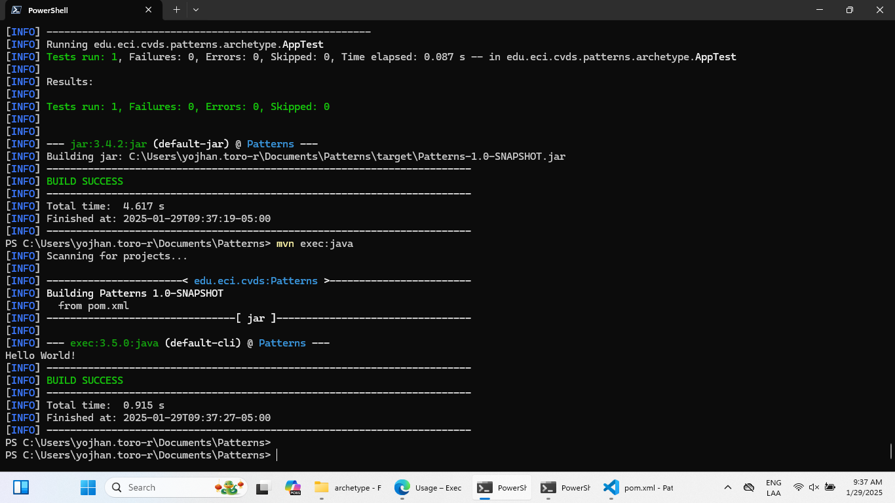
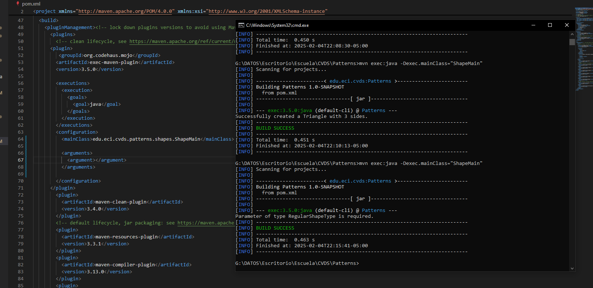
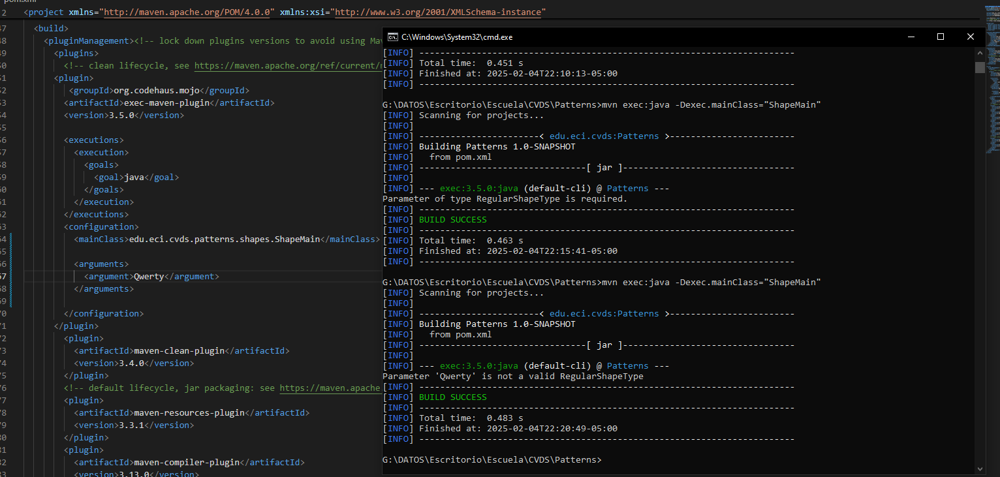
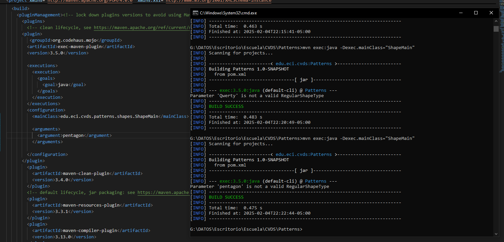
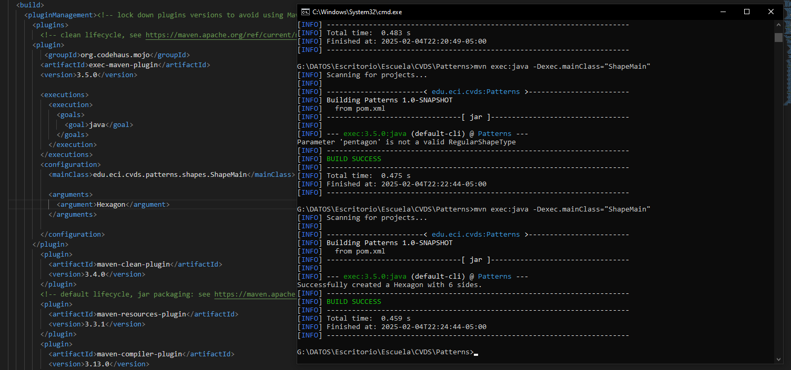

# Lab02CVDS
## Integrantes
Yojhan Toro - Ivan Cubillos
## Desarrollo

En primer lugar creamos con la estructura Maven según los lineamientos del laboratorio.
.png)

Y revisamos que se cumpla la estructura esperada
.png)

## AJUSTAR ALGUNAS CONFIGURACIONES EN EL PROYECTO

Hacemos los cambios, compilamos y ejecutamos 

## COMPILAR Y EJECUTAR

Hacemos los cambios en el POM y ejecutamos.

## EJECUCIONES MULTIPLES DE LA CLASE SHAPEMAIN

Escogimos la fabrica simple por la escala del proyecto. Sabiendo que al final todo se reduce a figuras que parten de Shape por lo mismo no es necesario sectorizar mas con una fabrica abstracta por ejemplo.

Para el primer caso parametro vacio nos arroja la siguiente salida

Para el segundo caso parametro incorrecto nos arroja la siguiente salida

Para el tercer caso parametro incorrecto nos arroja la siguiente salida

Para el cuarto caso parametro incorrecto nos arroja la siguiente salida

¿Cuál(es) de las anteriores instrucciones se ejecutan y funcionan correctamente y por qué?
Paso el cuarto caso ya que fue la unica que tenia una entrada valida, el pentagon no pasa ya que se establecio que que las figuras inician en mayusculay las demas no pasaron porque no son figuras o eran un valor vacio.
