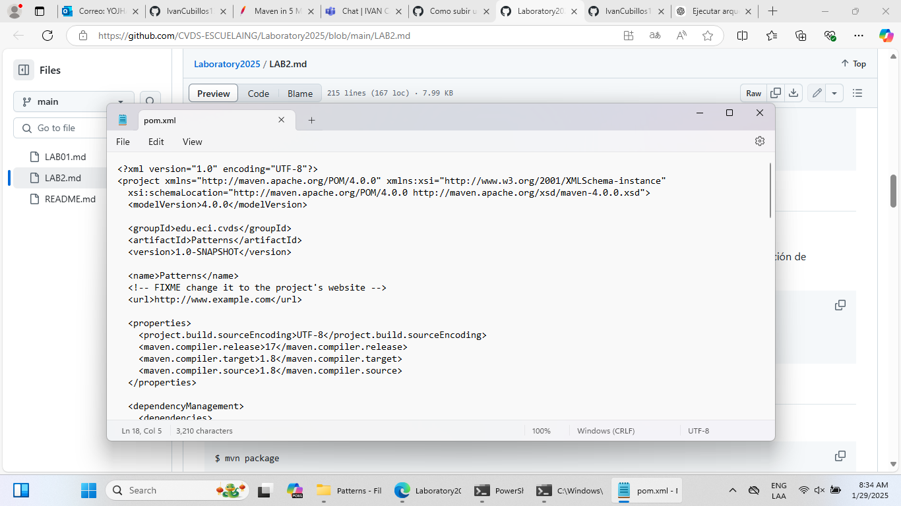
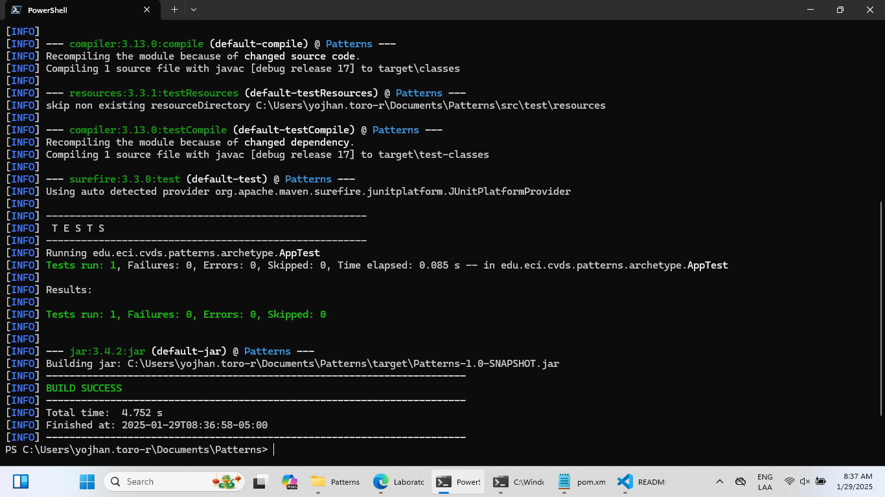
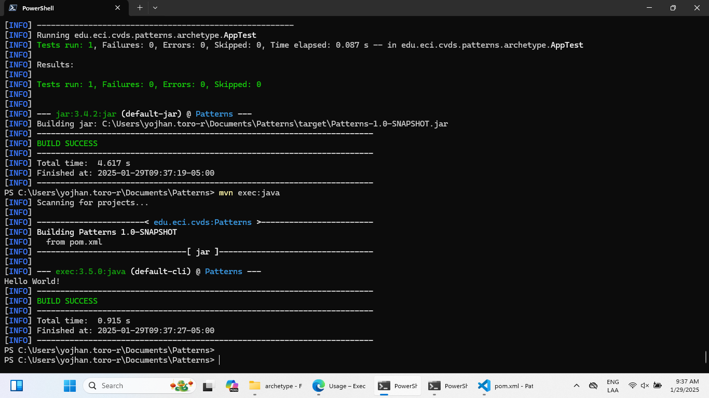

# Lab02CVDS
## Integrantes
Yojhan Toro - Ivan Cubillos
## Desarrollo

En primer lugar creamos con la estructura Maven según los lineamientos del laboratorio.
.png)

Y revisamos que se cumpla la estructura esperada
.png)

## AJUSTAR ALGUNAS CONFIGURACIONES EN EL PROYECTO

Hacemos los cambios, compilamos y ejecutamos 

## COMPILAR Y EJECUTAR

Hacemos los cambios en el POM y ejecutamos.
